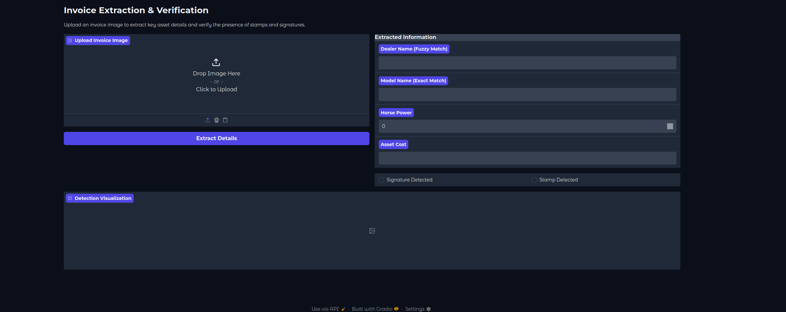
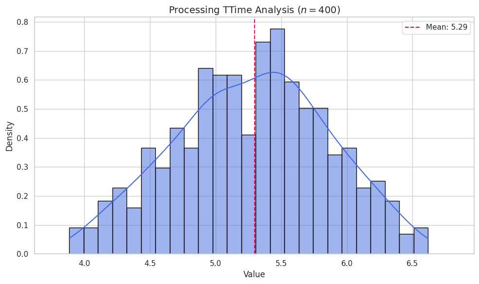
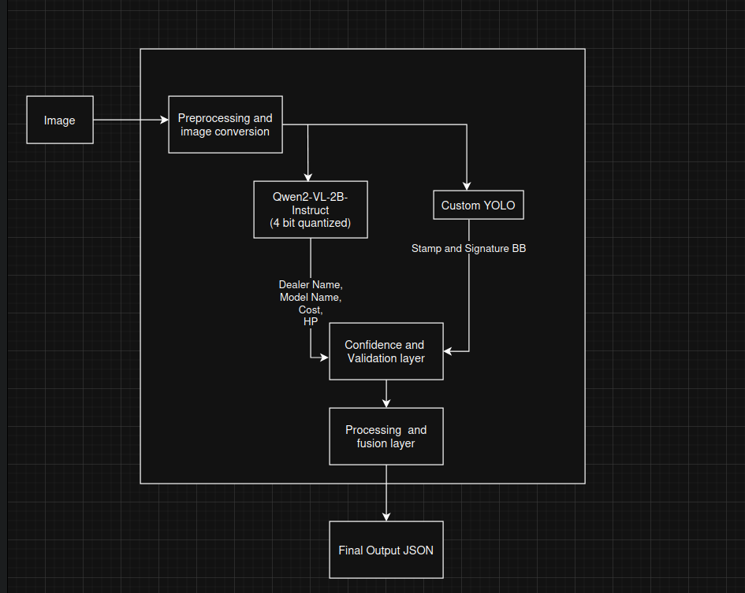

# Automated Extraction and Validation of Tractor Invoice Data
### How to interact:
### The given instructions are as per Ubuntu 22:
1) create a virtual env:
python -m venv venv


2 activate the virtual env
source venv/bin/activate
### Install dependencies 
Use:
pip -r requirements.txt

### Using the script
python executable.py <path/to/file>
## FrontEnd
<p align="center">
  
</p>

To run frontend run the following command:
python gradio_frontend.py
## Overview

This project is an **end-to-end document AI pipeline** designed to automatically extract and validate key information from **tractor invoice images** and output a structured JSON.
The system is built as a **hackathon demo** focusing on robustness, speed, and simplicity rather than heavy template-based or rule-based systems.

The pipeline works on **any kind of invoice image** (scanned or camera-captured) and does **not rely on predefined templates**.

---

## Problem Statement

Manual processing of tractor invoices for downstream workflows (such as loan processing or verification) is slow, error-prone, and not scalable.
This project demonstrates how intelligent vision-language models combined with lightweight object detection can automate invoice understanding and validation in a single pipeline.

---

## Key Features

* End-to-end pipeline: **Image → Structured JSON**
* Works on **any invoice image** without templates
* **Explicit stamp and signature verification** (often ignored in invoice extraction systems)
* **Cost-aware inference**: exposes time and dollar-cost estimates
* Minimal preprocessing, robust to varying image quality


## Architecture
<p align="center">
  
</p>
---
## Architecture
<p align="center">
  
</p>

---

## Input

* Any tractor invoice image
* Formats: scanned images or camera-captured photos
* No assumptions on resolution, layout, or template

---

## Output

The pipeline produces a structured JSON object:

```json
{
  "doc_id": "invoice_001",
  "fields": {
    "dealer_name": "ABC Tractors Pvt Ltd",
    "model_name": "Mahindra 575 DI",
    "horse_power": 50,
    "asset_cost": 525000,
    "signature": { "present": true, "bbox": [100, 200, 300, 250] },
    "stamp": { "present": true, "bbox": [400, 500, 500, 550] }
  },
  "confidence": 0.96,
  "processing_time_sec": 3.8,
  "cost_estimate_usd": 0.002
}
```

### Mandatory Fields

All extracted fields are **mandatory**:

* Dealer name
* Model name
* Horse power
* Asset cost
* Stamp presence + bounding box
* Signature presence + bounding box

---

## Pipeline Architecture

1. **Input Image**

   * Any invoice image (no constraints)

2. **Preprocessing**

   * Minimal preprocessing only
   * Basic resizing and normalization
   * No heavy denoising, rotation correction, or layout assumptions

3. **Text Extraction & Structuring**

   * A **Vision-Language Model (VLM)** is used to:

     * Read text directly from the image
     * Understand invoice semantics
     * Output structured fields directly in JSON format

4. **Stamp & Signature Detection**

   * A **Custom trained YOLO-based object detection model** is used
   * Purpose: only detect **presence and bounding boxes of Stamp and Signature**
   * No OCR or classification on stamps/signatures

5. **Post-processing**

   * Simple merge of VLM outputs and detection results
   * Confidence aggregation and metadata attachment

---

## Why YOLO for Stamps & Signatures

* Extremely fast inference
* Stamp and signature localization is a **pure object detection problem**
* Bounding boxes are sufficient; no complex reasoning required
* Easy to fine-tune within hackathon time constraints

---

## Performance (Demo-Scale)

> **Note:** All metrics are demo-scale estimates, not production benchmarks.

* Processing time: ~4 seconds per document
* Confidence score: ~0.96 (aggregated)
* Estimated inference cost: ~$0.002 per document. We have taken the hourly GPU inference cost to be 0.052
* Optimized for clarity and speed rather than throughput

---

## Limitations

* Evaluated only at **demo scale**
* No large annotated dataset
* Not optimized for high-volume production workloads

---

## Future Improvements

* Multi-language invoice support
* Batch processing of invoices
* Fraud detection using stamp/signature inconsistencies
* Validation against dealer and model master databases
* Model quantization for faster and cheaper inference

---

## Hackathon Context

This project was built specifically for a **hackathon setting**, prioritizing:

* Clear end-to-end functionality
* Strong architectural decisions
* Practical trade-offs between accuracy, speed, and complexity
